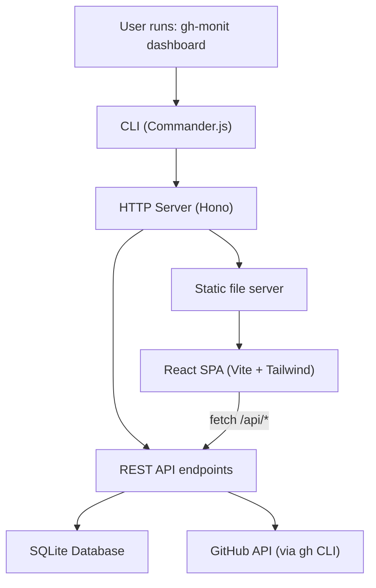

# Web Dashboard for gh-monit

## Architecture

The dashboard is split into two parts: a **backend API server** embedded in the CLI, and a **frontend SPA** built separately and served as static files.




## Project Structure

```
gh-monit/
├── src/
│   ├── index.ts                  # + register dashboard command
│   ├── cli/
│   │   └── dashboard.ts          # NEW: dashboard command + server startup
│   └── core/
│       ├── db.ts                 # + new query functions for dashboard
│       └── server.ts             # NEW: Hono API server + static serving
└── dashboard/                    # NEW: React SPA (separate package)
    ├── package.json
    ├── index.html
    ├── vite.config.ts
    ├── tailwind.config.ts
    ├── postcss.config.js
    ├── tsconfig.json
    └── src/
        ├── main.tsx
        ├── App.tsx
        ├── index.css             # Tailwind directives
        ├── api/
        │   └── client.ts         # Typed API client (fetch wrapper)
        ├── components/
        │   ├── Layout.tsx        # Shell: nav bar, theme toggle, content slot
        │   ├── SummaryCards.tsx   # Top-level stats (total repos, alerts, critical, high)
        │   ├── RepoGrid.tsx      # Responsive grid of repo cards
        │   ├── RepoCard.tsx      # Per-repo card: name, severity bars, sync time, refresh
        │   ├── AlertsTable.tsx   # Sortable/filterable alerts table for a selected repo
        │   ├── SeverityBadge.tsx # Color-coded severity pill
        │   └── ThemeToggle.tsx   # Light/dark toggle with system preference detection
        └── hooks/
            ├── useTheme.ts       # Dark mode state + localStorage persistence
            └── useDashboard.ts   # Data fetching + polling hook
```

---

## 1. Backend: New Dependencies

Add to the **root** `package.json`:

- `**hono**` -- Ultralight web framework (~50KB, TypeScript-first) for clean API routing
- `**@hono/node-server**` -- Node.js adapter for Hono (serves via `node:http`)

These are production dependencies since the server runs at runtime.

---

## 2. Backend: New Database Queries

Extend `[src/core/db.ts](src/core/db.ts)` with two new exported functions:

- `**getAllRepoSummaries(db)**` -- Returns all repos from `repo_sync` joined with alert counts grouped by severity. Single query with `GROUP BY repo, severity`.
- `**getRepoAlerts(db, repo)**` -- Wrapper around existing `getCachedAlerts` that also calls `sortAlerts` for convenience.

These reuse existing prepared statement patterns and the `NormalizedAlert` type.

---

## 3. Backend: API Server

New file: `[src/core/server.ts](src/core/server.ts)`

Uses Hono to define these routes:


| Method | Route | Description |
| ------ | ----- | ----------- |


- `**GET /api/repos**` -- List all tracked repos with severity counts and last sync timestamp. Calls `getAllRepoSummaries()`.
- `**GET /api/repos/:owner/:name/alerts**` -- Full sorted alert list for one repo. Calls `getRepoAlerts()`.
- `**GET /api/summary**` -- Global summary: total repos, total alerts, breakdown by severity. Aggregates from `getAllRepoSummaries()`.
- `**POST /api/repos/:owner/:name/refresh**` -- Fetches fresh alerts from GitHub via `fetchDependabotAlerts()`, normalizes with `normalizeAlerts()`, saves with `saveAlerts()`, returns updated alerts. Returns 500 if GitHub API fails.
- `**GET /***` -- Serves static files from the built dashboard directory, with SPA fallback (serves `index.html` for non-file paths).

The server factory function takes the `Database` instance and `dashboardDir` path as arguments, returning a configured Hono app.

---

## 4. Backend: CLI Command

New file: `[src/cli/dashboard.ts](src/cli/dashboard.ts)`

Registers a `dashboard` subcommand with Commander.js:

```
gh-monit dashboard [options]
```

Options:

- `--port <number>` (default: `3847`)
- `--no-open` (skip auto-opening browser)
- `--db <path>` (custom database path, same as existing commands)

Behavior:

1. Opens the SQLite database via `openDatabase()`
2. Resolves the dashboard static directory relative to the CLI bundle (using `import.meta.url` to find `dist/dashboard/`)
3. Creates the Hono server via the factory in `server.ts`
4. Starts `@hono/node-server` on the specified port
5. Prints the URL with chalk and optionally opens the browser via `open` (or `node:child_process.exec('open ...')` to avoid an extra dependency)
6. Handles SIGINT gracefully to close the database

Register in `[src/index.ts](src/index.ts)` alongside `registerDependabotCommand`.

---

## 5. Frontend: Dashboard SPA

### Setup

The `dashboard/` directory has its own `package.json` with:

- **Dependencies**: `react`, `react-dom`
- **Dev dependencies**: `vite`, `@vitejs/plugin-react`, `tailwindcss`, `@tailwindcss/vite`, `typescript`, `@types/react`, `@types/react-dom`

Vite config outputs build to `../dist/dashboard/` so it lands alongside the CLI bundle.

### UI Design

**Color palette**: Slate-based neutrals with severity accent colors:

- Critical: `red-500` / `red-400` (dark)
- High: `orange-500` / `orange-400`
- Medium: `yellow-500` / `yellow-400`
- Low: `blue-500` / `blue-400`

**Layout (responsive)**:

```
+-------------------------------------------------------+
|  gh-monit Dashboard                    [Theme Toggle]  |
+-------------------------------------------------------+
|  [Total Repos]  [Total Alerts]  [Critical]  [High]    |
+-------------------------------------------------------+
|  +-------------+  +-------------+  +-------------+    |
|  | repo/name   |  | repo/name   |  | repo/name   |    |
|  | ██ 3 crit   |  | ██ 0 crit   |  | ██ 1 crit   |    |
|  | ██ 5 high   |  | ██ 2 high   |  | ██ 0 high   |    |
|  | ██ 2 med    |  | ██ 1 med    |  | ██ 4 med    |    |
|  | Synced: 2m  |  | Synced: 1h  |  | Synced: 5m  |    |
|  | [Refresh]   |  | [Refresh]   |  | [Refresh]   |    |
|  +-------------+  +-------------+  +-------------+    |
+-------------------------------------------------------+
```

- **3 columns** on desktop (>=1024px), **2 columns** on tablet (>=640px), **1 column** on mobile
- Clicking a repo card expands an **AlertsTable** panel below with sortable columns: severity, package, ecosystem, state, created date, and a link to GitHub
- Dark mode uses Tailwind's `dark:` variant with `class` strategy, persisted to `localStorage`, defaults to system preference via `prefers-color-scheme`

### Key Components

- `**Layout.tsx**` -- Top navigation bar with title, last-refreshed timestamp, and `ThemeToggle`. Wraps page content.
- `**SummaryCards.tsx**` -- Four stat cards in a row. Each shows a label, a count, and a subtle severity-colored accent.
- `**RepoGrid.tsx**` -- Fetches `/api/repos`, renders a responsive CSS Grid of `RepoCard` components.
- `**RepoCard.tsx**` -- Shows repo name, horizontal severity breakdown bar, relative sync time ("2 min ago"), and a refresh button that POSTs to `/api/repos/:owner/:name/refresh`.
- `**AlertsTable.tsx**` -- Renders when a repo is selected. Sortable columns, severity badges, links to GitHub. Fetches from `/api/repos/:owner/:name/alerts`.
- `**SeverityBadge.tsx**` -- Small colored pill component (`critical` = red, etc.).
- `**ThemeToggle.tsx**` -- Sun/moon icon button. Toggles `dark` class on `<html>`.

### Data Fetching

`useDashboard.ts` custom hook:

- Fetches `/api/summary` and `/api/repos` on mount
- Exposes `refreshRepo(owner, name)` function
- Tracks loading/error state per repo
- Optional auto-polling every 60 seconds (configurable)

---

## 6. Build Integration

Update `[tsup.config.ts](tsup.config.ts)` to add a `publicDir` or post-build copy step. Since tsup doesn't natively handle static assets, the approach:

- Add a `build:dashboard` script: `cd dashboard && npm install && npm run build`
- Add a `build:cli` script: `tsup`
- Update `build` script: `npm run build:dashboard && npm run build:cli`

The Vite build outputs to `dist/dashboard/`, and the CLI resolves this path at runtime using `import.meta.url`.

Update `.gitignore` to ignore `dashboard/node_modules` and `dist/dashboard/`.

---

## 7. Summary of Files Changed/Created

**Modified:**

- `package.json` -- add `hono`, `@hono/node-server` deps; update build scripts
- `src/index.ts` -- register dashboard command
- `src/core/db.ts` -- add `getAllRepoSummaries()` and `getRepoAlerts()`
- `tsup.config.ts` -- no change needed (dashboard builds separately)
- `.gitignore` -- add `dashboard/node_modules`, `dist/dashboard/`

**New (backend):**

- `src/cli/dashboard.ts` -- CLI command registration + server startup
- `src/core/server.ts` -- Hono API server factory

**New (frontend -- `dashboard/` directory):**

- `package.json`, `index.html`, `vite.config.ts`, `tailwind.config.ts`, `postcss.config.js`, `tsconfig.json`
- `src/main.tsx`, `src/App.tsx`, `src/index.css`
- `src/api/client.ts`
- `src/components/Layout.tsx`, `src/components/SummaryCards.tsx`, `src/components/RepoGrid.tsx`, `src/components/RepoCard.tsx`, `src/components/AlertsTable.tsx`, `src/components/SeverityBadge.tsx`, `src/components/ThemeToggle.tsx`
- `src/hooks/useTheme.ts`, `src/hooks/useDashboard.ts`

